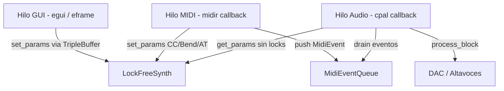
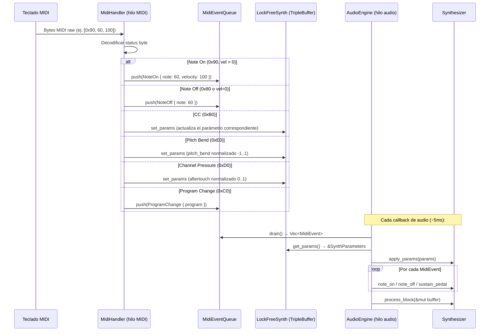
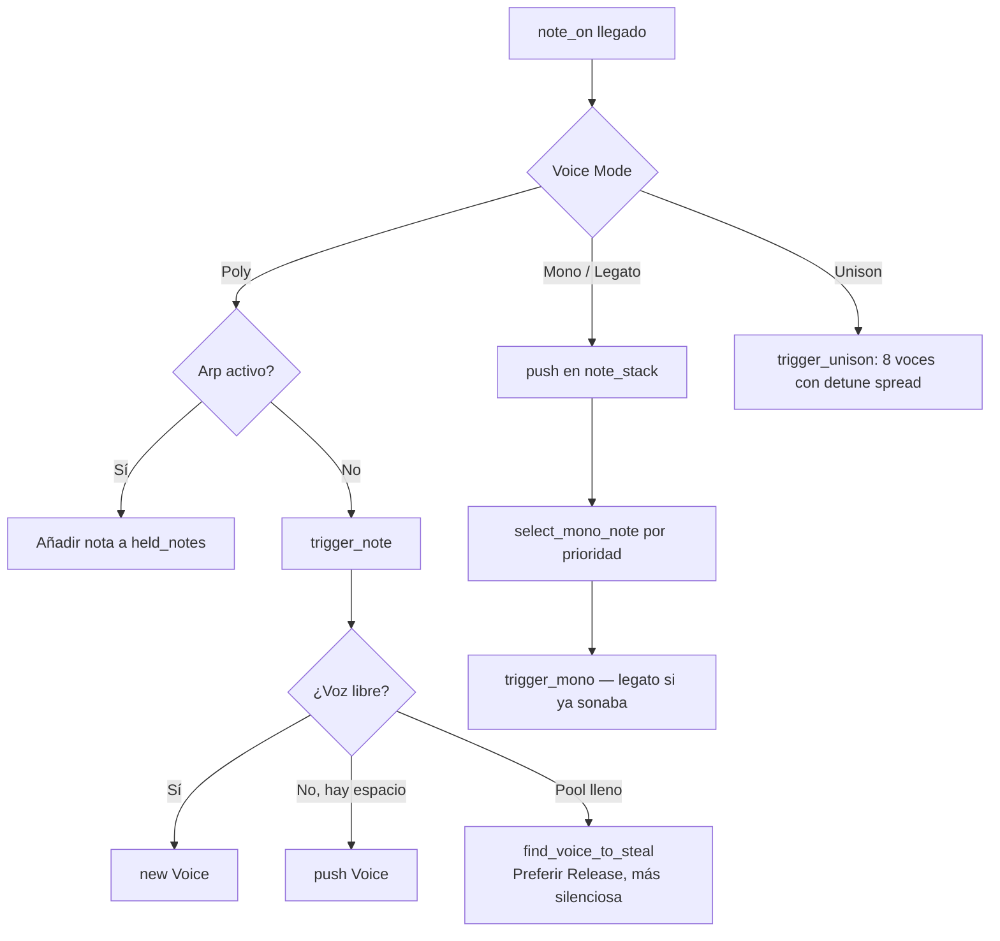
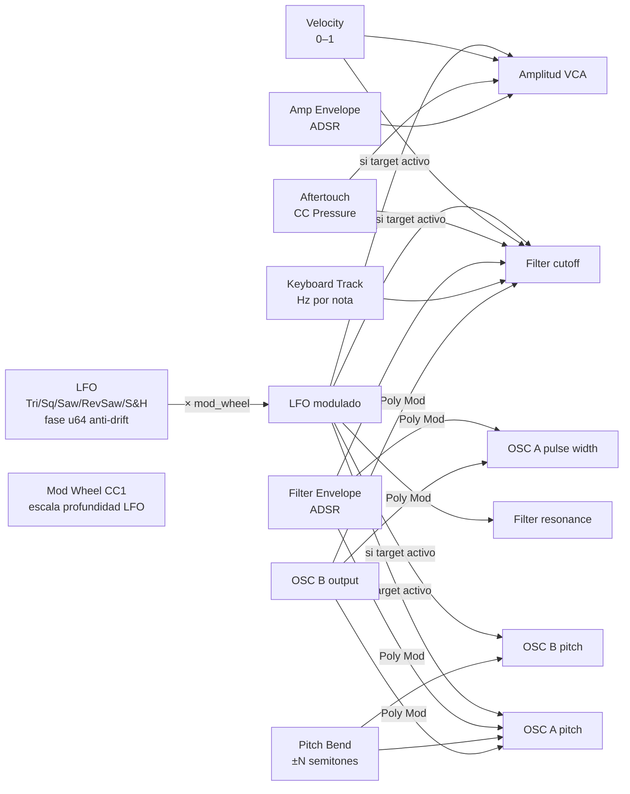

# Flujo de Señal: De la Tecla al Audio

Documento técnico del sintetizador analógico Prophet-5 en Rust.

---

## 1. Arquitectura de Hilos

El sistema usa tres hilos independientes para garantizar que el procesamiento de audio nunca se bloquee.



| Hilo | Responsabilidad | Mecanismo de sincronización |
|------|-----------------|-----------------------------|
| **GUI** | Renderizar controles, escribir parámetros | `TripleBuffer::write()` |
| **MIDI** | Recibir mensajes MIDI raw, mapear CCs | `MidiEventQueue::push()` + `TripleBuffer::write()` |
| **Audio** | Síntesis sample a sample | `TripleBuffer::read()` + `MidiEventQueue::drain()` |

---

## 2. Entrada MIDI: De la Tecla al Evento



El mapeo completo de MIDI CC está en [MANUAL.md](MANUAL.md#mapeo-de-control-change-cc).

---

## 3. Comunicación sin Locks: Triple Buffer

El parámetro continuo (knobs, sliders) viaja por un triple buffer lock-free. El GUI escribe, el audio lee — sin mutex, sin bloqueo.

```
  Buffer[0]  Buffer[1]  Buffer[2]
  ─────────  ─────────  ─────────
   WRITE ──►               SWAP
             READ ◄──

  new_data = true → audio swap read y swap
```

Los eventos discretos (Note On/Off, Sustain) van por `MidiEventQueue` con un `Mutex` fino — solo se accede una vez por bloque de audio, no por muestra.

---

## 4. Gestión de Voces

Al llegar un `note_on`, el sintetizador asigna una voz según el modo activo:



**Robo de voz** (`find_voice_to_steal`): puntúa cada voz activa — prefiere las que están en Release, con menor amplitud de envelope, y más tiempo en el estado actual.

---

## 5. Cadena de Señal por Voz (sample a sample)

Este es el núcleo: lo que ocurre para cada muestra de audio, para cada voz activa.

```mermaid
flowchart LR
    subgraph FREQ [Frecuencia]
        F1[MIDI note → Hz<br>tabla precalculada]
        F2[Glide: interpolación exponencial<br>hacia target freq]
        F3[VCO Drift: ±2.5 cents<br>tasa aleatoria por voz]
        F4[Detune OSC A / B<br>ratio = 2^cents/1200]
        F5[Pitch Bend ±N semitones]
        F6[Poly Mod: FiltEnv → freq OSC A<br>OscB → freq OSC A]
        F7[LFO → pitch OSC A/B<br>si lfo_target activo]
    end

    subgraph OSC [Osciladores]
        O1[OSC A: Saw/Sq/Tri/Sine<br>fase acumulada u64]
        O2[OSC B: Saw/Sq/Tri/Sine<br>fase acumulada u64<br>+ Sync opcional]
        ON[Ruido Rosa<br>xorshift32 + IIR Kellett]
        O1 --> |PolyBLEP/BLAMP| O1A[OSC A anti-alias]
        O2 --> |PolyBLEP/BLAMP| O2A[OSC B anti-alias]
    end

    subgraph MIX [Mixer]
        MX[OSC A × level<br>OSC B × level<br>Noise × level]
    end

    subgraph FILT [Filtro VCF]
        FC[Cutoff modulado:<br>base + FiltEnv + LFO + Vel<br>+ Kbd Track + Aftertouch<br>+ OscB PolyMod]
        FL[Moog Ladder ZDF 24dB/oct<br>4 stages TPT + fast_tanh<br>resonance 0-3.99<br>comp. de ganancia de passband]
    end

    subgraph ENV [Envelopes]
        EA[Amp ADSR: RC exponencial<br>Attack → Decay → Sustain → Release]
        EF[Filter ADSR: igual estructura<br>controla cutoff extra]
    end

    subgraph AMP [VCA]
        VA[× Amp Envelope<br>× LFO amplitude mod<br>× Velocity mod<br>× Aftertouch amplitude]
    end

    FREQ --> OSC
    OSC --> MIX
    MIX --> FILT
    EF --> FILT
    FILT --> AMP
    EA --> AMP
    AMP --> SUM[Suma de voces]
```



---

## 6. Cadena de Procesado Global (post-voces)

Después de sumar todas las voces, la señal pasa por la cadena de efectos y protección de salida:


### Detalles del Filtro Moog Ladder (ZDF TPT)

El filtro usa la topología ZDF (Zero-Delay Feedback) de Zavalishin, que mapea exactamente el corte analógico:

```
g  = tan(π · fc / fs)          ← pre-warping bilineal
G  = g / (1 + g)               ← ganancia TPT por etapa

Por etapa:
  v = G · (tanh(entrada) - estado)
  y = v + estado
  estado_nuevo = y + v

Feedback de resonancia (1-sample delay):
  x_in = tanh(input - k · stage4)   k ∈ [0, 3.99)

Compensación passband:
  output = stage4 × (1 + k × G⁴)
```

`fast_tanh` usa una aproximación de Padé (error < 0.1% para |x| ≤ 3) en lugar de `libm::tanh` para reducir latencia en el bucle interno.

---

## 7. Modulación: Diagrama de Rutas



---

## 8. LFO: Detalles de Implementación

```
Phase accumulator: u64 de 32 bits fraccionales
  phase_increment = (freq / sample_rate) × 2³²
  accumulator = accumulator.wrapping_add(increment)
  phase_float = (accumulator & MASK) / 2³²

Formas de onda:
  Triangle:       fase < 0.5 → -1 + 4·t  /  fase ≥ 0.5 → 3 - 4·t
  Square:         fase < 0.5 → -1  /  fase ≥ 0.5 → +1
  Sawtooth:       -1 + 2·fase
  RevSawtooth:    1 - 2·fase
  Sample & Hold:  valor aleatorio fijo, actualizado ~100 veces/s

LFO Delay/Fade-in:
  Cada voz tiene lfo_delay_elapsed
  El LFO sube de 0 a amplitud_total en lfo_delay segundos

Keyboard Sync:
  Al trigger_note → lfo_phase_accumulator = 0
```

---

## 9. Modos de Voz

| Modo | Voces activas | Comportamiento |
|------|---------------|----------------|
| **Poly** | Hasta 8 | Una voz por nota, robo inteligente |
| **Mono** | 1 | Stack de notas, prioridad configurable (Last/Low/High) |
| **Legato** | 1 | Como Mono, pero no re-triggeriza envelopes al cambiar nota |
| **Unison** | 8 | Todas las voces suenan la misma nota con detune spread |

**Unison spread**: distribuye las voces uniformemente en ±spread/2 cents. Con 8 voces y spread=10, las voces van de -5 a +5 cents.

---

## 10. Flujo Completo: De la Tecla al DAC

```
Tecla pulsada en teclado MIDI
        │
        ▼
[Hilo MIDI: midir callback]
  decode bytes → NoteOn{60, 100}
  push → MidiEventQueue
        │
        ▼
[Cada ~5ms: cpal audio callback]
  drain MidiEventQueue
  get_params (TripleBuffer, sin lock)
  apply_params al Synthesizer
        │
        ▼
  note_on(60, 100)
    → asignar/robar voz
    → Voice::new(note=60, freq=261.63 Hz, vel=0.787)
    → envelope_state = Attack
        │
        ▼
  process_block(&mut [f32; N])
    Por cada muestra:
    ├── update LFO (u64 accumulator)
    └── Por cada voz activa:
        ├── Glide → freq interpolada
        ├── VCO Drift → ±2.5 cents aleatorios
        ├── Calcular freq1, freq2 con detune + mods
        ├── Avanzar phase1, phase2 (u64 wrapping)
        ├── OSC A → generate waveform + PolyBLEP
        ├── OSC B → generate waveform + PolyBLEP (± sync)
        ├── Noise → xorshift32 + IIR pink
        ├── Mixer: osc1×lvl + osc2×lvl + noise×lvl
        ├── Filter Envelope ADSR → filter_envelope_value
        ├── Calcular cutoff modulado (8 fuentes)
        ├── Ladder Filter ZDF TPT 4-stage → sample filtrado
        ├── Amp Envelope ADSR → envelope_value
        ├── VCA: × env × lfo × vel × aftertouch
        └── acumular en sample
    ├── Normalizar por √N voces
    ├── × master_volume × expression
    ├── Delay (línea circular)
    ├── Reverb (Freeverb: 8 comb + 4 allpass)
    ├── Saturación tanh
    ├── DC Blocker HPF 0.7 Hz
    └── Clamp ±1.0
        │
        ▼
[cpal: mono → stereo interleaved]
  T::from_sample(sample_f32)
        │
        ▼
[Soft Limiter en AudioEngine]
  |x| ≤ 0.8 → linear
  |x| > 0.8 → 0.8 + 0.2·(1 - e^(-5·(|x|-0.8)))
        │
        ▼
DAC → Altavoces 🔊
```

---

## 11. Rendimiento y Decisiones de Diseño

| Decisión | Razón |
|----------|-------|
| `u64` como phase accumulator | Elimina drift de fase en notas largas; flotante acumula error |
| `fast_tanh` Padé en el filtro | 5 llamadas/voz/muestra — reducción ~40% vs `libm::tanh` |
| `fast_sin` tabla LUT para drift | Evita `sin()` en bucle interno de 8 voces × 44100 Hz |
| Triple buffer sin locks | El audio thread nunca bloquea esperando al GUI |
| `MidiEventQueue` con Mutex fino | Nota on/off ocurre a velocidad humana — no compite con el audio |
| Voice norm `1/√N` | Mantiene RMS constante independiente del número de voces activas |
| PolyBLEP/BLAMP anti-aliasing | Elimina aliasing digital sin oversampling costoso |
| Pink noise per-voice xorshift32 | Determinista, ~8× más rápido que `rand::random()`, independiente por voz |
| Denormal flush en ladder filter | Previene slowdown ~100× en colas de silencio por denormales IEEE 754 |
